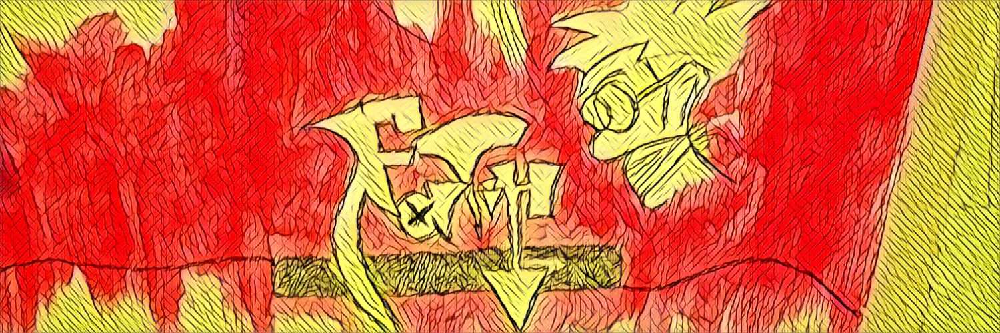

## 👋 About Me

Hi, I'm **Fatih Mahmut** from **Turkey** – a passionate self-taught full-stack developer with a strong enthusiasm for building robust and scalable applications. I have a deep passion for Linux, especially , and the open-source ecosystem. I thrive on learning new technologies and continuously improving my craft.

## 🚀 Current Focus

I'm currently diving deep into modern technologies and cloud platforms to expand my expertise:

## 💻 Tech Stack

### Languages

### Frameworks & Libraries

### Tools & Platforms

## 📊 GitHub Stats

## 📫 Connect With Me

Feel free to reach out if you want to collaborate on projects, discuss technology, or just connect!

